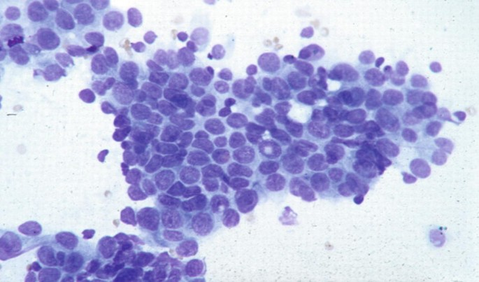

---
title: "FID-G5"
output: html_notebook
---

# Análisis de Datos de Imágenes FNA para el Diagnóstico de Cáncer de Mama

**Autores:** Claudia Heredia Ceballos, Manuel Otero Barbasán, Marta Pineda Gisbert, Javier Fernández Castillo.

**Grupo:** G5.

**Organización**: Universidad de sevilla.

## Resumen

Este proyecto tiene como objetivo la aplicación de técnicas de aprendizaje supervisado y no supervisado para el diagnóstico de cáncer de mama, utilizando un conjunto de datos que contiene características extraídas de imágenes de aspirado con aguja fina (FNA) de masas mamarias. El conjunto de datos contiene 569 muestras, con 357 benignas y 212 malignas, y 33 características que describen diversas propiedades de los núcleos celulares en las imágenes. En este estudio, se explorarán varios enfoques de clasificación supervisada, como **CART**, **Random Forest** y **SVM**, para predecir el diagnóstico de las muestras, además de aplicar técnicas no supervisadas como el **clustering** y la **reducción de dimensionalidad** a través de **PCA**. Se espera que el análisis combinado de ambos enfoques permita mejorar la precisión en el diagnóstico y proporcionar una mejor comprensión de los patrones subyacentes en los datos. **Se discutirán los resultados obtenidos y se presentarán conclusiones sobre la efectividad de las técnicas empleadas.**

## 1. Introducción

El diagnóstico temprano y preciso del cáncer de mama es crucial para un tratamiento exitoso. En este estudio, se emplea el conjunto de datos [**Breast Cancer Wisconsin (Diagnostic) Data Set**](https://archive.ics.uci.edu/ml/datasets/Breast+Cancer+Wisconsin+%28Diagnostic%29), que contiene características derivadas de imágenes FNA de células de tejido mamario.

El FNA es una técnica de diagnóstico utilizada para evaluar la naturaleza de las masas mamarias. Durante el procedimiento, se extrae una pequeña cantidad de tejido de la masa y se examina bajo un microscopio para determinar si es benigna o maligna. Las características de las células, como la forma, el tamaño y la textura de los núcleos, pueden proporcionar información valiosa sobre la naturaleza del tumor.

En la **Figura 1** se ilustra el procedimiento de aspiración con aguja fina (FNA), que muestra la inserción de la aguja para extraer las células del tumor. La **Figura 2** presenta una imagen microscópica de las células extraídas, permitiendo observar sus características una vez realizado el FNA.

::: {style="text-align: center;"}
 <br> <b>Figura 1:</b><i>Procedimiento FNA</i>
:::

::: {style="text-align: center;"}
 <br> <b>Figura 2:</b><i> Células extraídas de FNA</i>
:::

El conjunto de datos incluye 33 características, como el radio, la textura, el perímetro y la simetría de los núcleos celulares, las cuales se utilizan para determinar si una muestra es **benigna** o **maligna**. El análisis se centra en la aplicación de técnicas de aprendizaje supervisado, como **CART**, **Random Forest** y **SVM**, para predecir el diagnóstico basado en las características numéricas. Además, se aplicarán técnicas de aprendizaje no supervisado, como el **clustering** y la **reducción de dimensionalidad** mediante **PCA** , para explorar los patrones ocultos en los datos y posiblemente mejorar la precisión de los modelos.

## 2. Metodología

El desarrollo de este proyecto se llevará a cabo a través de un enfoque estructurado y secuencial en varias fases, con el objetivo de analizar y predecir el diagnóstico de cáncer de mama utilizando imágenes FNA. Los pasos clave del proceso son los siguientes:

1.  **Análisis Inicial y Preprocesamiento de los Datos**\
    En esta fase inicial, se procederá con la carga de los datos del conjunto de datos "Breast Cancer Wisconsin (Diagnostic)", que contiene las características extraídas de imágenes de aspiración con aguja fina (FNA). Se realizará una exploración preliminar de los datos para comprender la naturaleza de las variables y la distribución de las clases (benigno y maligno). Además, se identificará y gestionará cualquier valor faltante, y se evaluará la necesidad de realizar transformaciones adicionales, como la normalización o la conversión de variables categóricas.

2.  **Aplicación de Modelos Supervisados**\
    En esta etapa, se implementarán y entrenarán varios **modelos supervisados** para la clasificación de los tumores como benignos o malignos. Los modelos seleccionados incluyen:

    -   **CART (Classification and Regression Trees)**: Un modelo de árbol de decisiones que permite realizar predicciones mediante una serie de reglas basadas en los datos de entrada.
    -   **Random Forest**: Un conjunto de árboles de decisión que mejora la precisión mediante el uso de técnicas de muestreo y combinación de varios modelos.
    -   **SVM (Support Vector Machine)**: Un modelo que encuentra el hiperplano óptimo que separa las clases de manera eficaz.
    -   **GLM (Generalized Linear Model)**: Un modelo estadístico que puede adaptarse a diferentes distribuciones de las variables dependientes, como la binomial en este caso.\
        Se evaluará la **Importancia de las Variables** en los modelos para identificar las características más influyentes en las predicciones.

3.  **Experimentación con el Dataset Reducido**\
    Posteriormente, se realizará una **experimentación** en la que se modificarán las características del dataset mediante la eliminación de variables menos relevantes, basándose en la **importancia de las variables** obtenida de los modelos. Esto permitirá optimizar los modelos y reducir el sobreajuste, mejorando la capacidad de generalización del sistema de diagnóstico.

------------------------------------------------------------------------

4.  **Aplicación de Modelos No Supervisados**\
    Para explorar los patrones subyacentes en los datos sin utilizar etiquetas de clase, se implementarán **modelos no supervisados**. Estos incluirán:
    -   **Clustering**: Se utilizarán técnicas como **K-means** para agrupar las observaciones de acuerdo con similitudes en sus características. Esto permitirá identificar posibles grupos de datos que podrían no haber sido evidentes en la clasificación supervisada.
    -   **Reducción de Dimensionalidad**: Para reducir el número de variables y simplificar el análisis, se emplearán técnicas como **PCA (Principal Component Analysis)**. Estas técnicas ayudarán a descubrir las estructuras latentes en los datos y facilitarán la visualización y el análisis posterior.
5.  **Presentación de los Resultados y Conclusiones**\
    Finalmente, se presentarán los **resultados** obtenidos de los modelos evaluados, incluyendo tablas, gráficos y análisis comparativos. En esta sección se discutirá la efectividad de las técnicas empleadas, destacando los modelos más precisos y los enfoques que mejor se ajustan a las necesidades del diagnóstico de cáncer de mama. Las **conclusiones** se centrarán en la viabilidad y los posibles pasos a seguir para mejorar el rendimiento del modelo y su aplicabilidad en un entorno clínico.

## 3. Implementación

En esta sección se muestran los pasos que se han seguido para la realización del proyecto. Incluye el Análisis Inicial y Preprocesamiento de los Datos, los modelos supervisados y no supervisados utilizados.

### 3.1. Análisis Inicial y Preprocesamiento de los Datos.

#### 3.1.1. Importación de librerías

Se instalan los paquetes que serán necesarios durante el proyecto:

-   Tidyverse: Para la manipulación de datos y gráficos.
-   Caret: Para el preprocesamiento y modelado Lattice es requerido por Caret
-   DataExplorer: Para la exploración automatizada de los datos.
-   Dplyr: Proporciona una gramática de manipulación de datos.
-   Ggplot2: Personalización de gráficas.
-   Psych: Para análisis estadístico
-   Corrplot: Visualización de matriz de correlación.
-   Car:  Para complementar técnicas de regresión.
-   pRoc: Proporciona herramientas para visualizar., suavizar y comparar curvas Roc.

```{r setup, warning=FALSE, message=FALSE}
# Nota: Descomentar las líneas de instalación si no se tienen los paquetes instalados. Comando ctrl+shift+c para descomentar.

#install.packages("tidyverse")
#install.packages("caret")
#install.packages("DataExplorer")
#install.packages("dplyr")
#install.packages("ggplot2")
#install.packages("lattice")
#install.packages("psych")
#install.packages("corrplot")
#install.packages("ggcorrplot")
#install.packages("car")
#install.packages("pROC")
library(tidyverse)
library(caret)
library(DataExplorer)
library(dplyr)
library(ggplot2)
library(lattice)
library(psych)
library(corrplot)
library(ggcorrplot)
library(pROC)
library(car)
```

#### 3.1.2. Carga y visualización de datos

Para comenzar el análisis es necesario realizar la carga de los datos, se visualizan las primeras filas y la estructura de nuestro dataset.

```{r}
data <- read.csv("data/data.csv")

head(data)
```


```{r}
dim <- dim(data)

cat("Número de columnas:", dim[2], "\n")
cat("Número de filas:", dim[1], "\n")
```
Como podemos observar, nuestro dataset cuenta con 569 filas y 33 columnas.


A continuación, se muestra la estructura, tipos y algunos ejemplos de las variables del dataset para tener una visión global del las distintas variables con las que se cuenta.

```{r}
str(data)
```

```{r}
# sapply aplica una función a cada columna del dataframe
clases <- sapply(data, class)
clases_df <- data.frame(Clase = clases)

print(clases_df, row.names = FALSE)
```
Se obtienen las clases de cada columna en el conjunto de datos para entender mejor su tipo de datos y estructura. Esto permite visualizar rápidamente el tipo de variable (numérica, categórica, etc.) que se encuentra en el dataset.


Se visualiza un resumen estádistico de los datos.

```{r}
describe(data)
```


Se verifica si existen valores faltantes en los datos utilizando la función `anyNA()`. Esto permite identificar rápidamente si hay datos incompletos en el dataset que puedan requerir limpieza o manejo especial.

```{r}
anyNA(data)
```

Se observa que existen valores faltantes en el dataset. Para visualizar de manera más clara la cantidad de valores faltantes por columna, se utiliza la función `plot_missing(data)`.

```{r}
plot_missing(data)
```

Como puede observarse, se cuenta con 569 valores faltantes en la última columna "X". Más adelante se procederá a eliminar esta columna.

#### 3.1.3. Análisis exploratorio de los datos

En este paso el objetivo será entender la distribución y relaciones de variables.

##### 3.1.3.1. Visualización de distribuciones y correlaciones:

Se visualiza un resumen gráfico general para entender las distribuciones y correlaciones entre las variables en el conjunto de datos. Esto ayuda a identificar patrones, distribuciones de frecuencia y posibles relaciones entre las diferentes columnas del dataset.

```{r}
plot_intro(data)
```

Como se puede observar, el dataset cuenta con un 3% de columnas discretas, en concreto la columna "diagnosis" que es la variable objetivo, y un 94% de columnas continuas. Además, se observa un 3% de columnas con valores faltantes, que corresponden a la columna "X".

Se visualizan las variables categóricas que dice si el tumor es "Maligno" o "Benigno" para contar cuántas observaciones hay de cada tipo. Esto permite ver la distribución de la columna diagnosis y entender la proporción entre ellas en el dataset.

```{r}
diagnosis_counts <- table(data$diagnosis)
plot_bar(data$diagnosis)
print("Distribución de la variable 'diagnosis' Benigno (B) y Maligno (M):")
print(diagnosis_counts)
```

La columna "diagnosis" contiene dos clases: "B" (Benigno) y "M" (Maligno). La distribución de las clases es desigual, con 357 observaciones de la clase "B" y 212 observaciones de la clase "M". Esto indica un desequilibrio ligero en la distribución de las clases.

Para visualizar la distribución de las variables numéricas, se utiliza la función `plot_histogram(data)`. Esto permite ver la distribución de cada variable en el dataset y comprender mejor la variabilidad y rango de valores de las características.

```{r}
plot_histogram(data)
```

Como se puede observar, las variables numéricas presentan diferentes distribuciones y rangos de valores. Algunas variables, como "concave.points_worst", parecen tener una distribución sesgada hacia la derecha, mientras que otras, como "symmetry_mean", parecen tener una distribución más simétrica. Estas diferencias en las distribuciones pueden ser útiles para identificar patrones y relaciones entre las variables.

#### 3.1.4. Preprocesamiento de los datos

Es necesario realizar un preprocesamiento de los datos para limpiarlos y prepararlos para el análisis y modelado. Esto incluye la eliminación de valores faltantes, la codificación de variables categóricas y la selección de atributos relevantes.

##### 3.1.4.1. Eliminación de valores faltantes

Para comenzar, se ha identificado que hay una columna con todos los valores faltantes, es decir, NA. El primer paso en el preprocesamiento será eliminar esta columna "x".

Se verifica que la columna "X" se haya eliminado correctamente y que no haya otros valores faltantes en el dataset.

```{r}
data <- data %>% select(-X)
plot_missing(data)
anyNA(data)
```

No quedan valores faltantes en el dataset, por lo que se procederá a eliminar la columna "id", ya que no aporta información relevante.

```{r}
data <- data %>% select(-id)

print("Busqueda de columna id en el dataset:")
print("id" %in% colnames(data))

```

Como se puede observar, se ha eliminado la columna "id" y se ha verificado que no hay más valores faltantes, excepto los ya eliminados en "X".

Después de estos procesos, contamos con un dataset de:

```{r}
dim <- dim(data)

cat("Número de columnas:", dim[2], "\n")
cat("Número de filas:", dim[1], "\n")
```

569 filas y 31 columnas.

##### 3.1.4.2. Codificación de variables Categóricas

Anteriormente, vimos que nuestro dataset cuenta con una única columna de valores categóricos, "Diagnosis", cuyos valores tienen el siguiente significado: - M (malignant) - B (benign)

El siguiente paso en el preprocesado de datos será pasar esta columna a numérica, lo que será necesario para estudiar la correlación de variables de nuestro dataset. 

Como solo se presentan dos posibles valores ("M" y "B"), se aplicará Codificación Binaria: El valor "M" pasará a ser 1 y valor "B" pasará a ser 0.


```{r}

#M -> 1; B -> 0
data$diagnosis <- ifelse(data$diagnosis == "M", 1, 0)
```

Se verifica que la columna "diagnosis" se haya codificado correctamente.

```{r}
# imprimir los primeros valores de la columna diagnosis, formateado
print("Valores de la columna 'diagnosis' después de la codificación:")
data$diagnosis
```

A continuación, se verifica que todas las columnas del dataset sean numéricas, ya que algunos modelos de aprendizaje automático requieren que todas las variables de entrada lo sean. Para ello, se identifican las columnas categóricas y se comprueba que todas las columnas sean numéricas.

```{r}

categorical_columns <- sapply(data, is.factor) | sapply(data, is.character)
names(data)[categorical_columns]


```

Efectivamente, todas las columnas ahora son numéricas, lo que da paso al siguiente punto en el preprocesamiento de datos.

##### 3.1.4.3. Estudio de correlación.

Al tener el dataset limpio de valores faltantes, NA, y solo hay presentes variables numéricas, el siguiente paso será estudiar las posibles correlaciones de nuestro dataset.

Estudiar la correlación de los datos ayuda a identificar patrones y relaciones entre variables, lo que podría conducir a nuevas hipótesis y descubrimientos. Además, un buen estudio de correlaciones podría ser útil para seleccionar variables relevantes y construir modelos en un futuro.

Los valores que se obtienen tendrán la siguiente interpretación:

-   Correlación cercana a 1: Relación positiva fuerte.
-   Correlación cercana a -1: Relación negativa fuerte.
-   Correlación cercana a 0: No hay relación lineal significativa

Se calcula la matriz de correlación para el conjunto de datos utilizando solo las observaciones completas. Esto permite visualizar las relaciones lineales entre las variables numéricas del dataset, identificando patrones de correlación positiva y negativa entre las diferentes variables.

```{r}

# Calcular matriz de correlación
correlation_matrix <- cor(data, use = "complete.obs")  # Ignora valores faltantes


# Graficar matriz de correlación
corrplot(correlation_matrix, method = "color", type = "upper", tl.cex = 0.8)

```

Como se puede observar, dado que el conjunto de datos contiene 31 variables, la matriz de correlación resulta difícil de interpretar directamente. Para facilitar la comprensión de las relaciones entre las variables, se muestra a continuación una tabla con las parejas de atributos ordenadas por la magnitud de la correlación.

```{r}
# Eliminar la columna 'diagnosis' antes de calcular las correlaciones
data_no_target <- data[, !names(data) %in% c("diagnosis")]

cor_matrix <- cor(data_no_target, use = "complete.obs")

cor_matrix_df <- as.data.frame(as.table(cor_matrix))
cor_matrix_df <- cor_matrix_df[cor_matrix_df$Var1 != cor_matrix_df$Var2, ]
cor_matrix_df <- cor_matrix_df[order(-abs(cor_matrix_df$Freq)), ]
# Eliminar duplicados. a<->b = b<->a
cor_matrix_df <- cor_matrix_df[seq(1, nrow(cor_matrix_df), by = 2), ]

print(cor_matrix_df)
```

En la tabla se presentan las correlaciones entre las variables independientes del conjunto de datos. Se observan correlaciones altas entre algunas de las variables, como **perimeter_mean y radius_mean** (0.998), **perimeter_worst y radius_worst** (0.994), **area_mean y radius_mean** (0.987), y **area_worst y perimeter_worst** (0.978). Estas altas correlaciones tienen sentido porque las variables de **radio** (radius) y **perímetro** (perimeter) están matemáticamente relacionadas: a medida que el radio de un tumor aumenta, también lo hace su perímetro, lo que explica las correlaciones cercanas a **1**. Similarmente, las variables de **área** también están fuertemente correlacionadas con el radio y el perímetro, ya que un tumor con un mayor radio suele tener una mayor área. Aunque estas correlaciones son altas, no son sorprendentes, ya que todas están capturando diferentes aspectos del **tamaño** y la **forma** del tumor.

Dado que "diagnosis" es nuestra variable objetivo, vamos a observar cómo se correlacionan las demás variables con ella para entender mejor su relación y posibles influencias.

```{r}
cor_with_target <- cor(data, data$diagnosis, use = "complete.obs")
correlation_df <- data.frame(Variable = names(data), Correlation = cor_with_target)
correlation_df_sorted <- correlation_df[order(-correlation_df$Correlation), ]
print(correlation_df_sorted)
```

En esta tabla se presenta la correlación de cada variable con la variable objetivo **'diagnosis'**. La correlación de **'diagnosis'** consigo misma es **1**, como es esperado. Las variables que presentan las correlaciones más altas con **'diagnosis'** son **concave.points_worst** (0.793), **perimeter_worst** (0.782), **concave.points_mean** (0.776), **radius_worst** (0.776) y **perimeter_mean** (0.743). Estas correlaciones indican que las características relacionadas con el **número de puntos cóncavos** y el **perímetro** del tumor están fuertemente asociadas con el diagnóstico, lo que las convierte en buenos predictores del diagnóstico maligno o benigno. En general, las variables que presentan correlaciones superiores a **0.7** sugieren que son relevantes para la predicción de la variable objetivo. Estas características del **tamaño** y la **forma** del tumor, como el perímetro y los puntos cóncavos, son especialmente importantes para predecir si el tumor es maligno o benigno.

Las variables menos correlacionadas con **'diagnosis'** son **symmetry_se** (-0.006), **fractal_dimension_se** (-0.077), **texture_se** (-0.008), **smoothness_se** (-0.067) y **fractal_dimension_mean** (-0.012). Estas correlaciones cercanas a **0** indican que estas características no están fuertemente asociadas con el diagnóstico y pueden no ser tan relevantes para la predicción. Esto tiene sentido ya que son errores estándar y medidas de textura y suavidad que podrían no ser tan informativas para distinguir entre tumores malignos y benignos.

##### 3.1.4.4. Selección de Atributos

La selección de atributos se refiere al proceso de identificar y elegir las variables más relevantes para un análisis, descartando las redundantes o irrelevantes para mejorar la calidad y eficiencia del modelo. En este caso, dado que algunas variables en el dataset muestran altas correlaciones entre sí, se podría considerar eliminarlas para reducir la dimensionalidad y simplificar el análisis.
88
A pesar de las correlaciones fuertes entre ciertas variables, ninguna es mayor de 0,8-0.9 por lo que eliminarlas podría no ser adecuado ya que el conjunto de datos es limitado. La eliminación de variables podría llevar a una pérdida significativa de información valiosa que podría ser crucial para el análisis y las predicciones. Mantener todas las variables como "area_mean" o "perimeter_mean" aporta información única y valiosa al modelo, lo que permite capturar un panorama más completo del tumor.

Por lo tanto, se optará por mantener todas las variables.

### 3.2. Análisis Supervisado.

El aprendizaje supervisado, también conocido como machine learning supervisado, es una subcategoría del machine learning y la inteligencia artificial. Se define por el uso de conjuntos de datos etiquetados para entrenar algoritmos que clasifican los datos o predicen los resultados con precisión.

A medida que se introducen datos en el modelo, este ajusta sus ponderaciones iterativamente hasta que se ha alcanzado un ajuste adecuado, proceso que ocurre como parte de la validación cruzada.

En este análisis, la variable a predecir será "diagnosis", que como se mencionó previamente, es binaria: 1 si el tumor es maligno y 0 si es benigno.

Se evaluaron diferentes modelos de clasificación para un conjunto de datos con 569 muestras y 30 variables, categorizados en 'Benigno' y 'Maligno'. Los modelos analizados incluyen el Árbol de Decisión (CART), Random Forest (Bosque Aleatorio), Máquinas de Soporte Vectorial con núcleo Radial (SVM), Modelo Lineal Generalizado (GLM) y un clasificador con redes neuronales.

El primer paso en el análisis supervisado es realizar la división del dataset.

#### 3.2.1. División del Dataset:

Para este paso, se utilizará la validación cruzada K-fold para dividir el dataset y evaluar el modelo. En lugar de una división simple en entrenamiento y prueba, K-fold asegura que cada subconjunto o fold del dataset sea utilizado tanto para el entrenamiento como para la prueba en diferentes iteraciones, proporcionando así una evaluación más robusta.

Establecemos una semilla para asegurar que los resultados sean reproducibles, es decir, que se obtengan los mismos resultados cada vez que se ejecute el código. Luego, configuramos el K-fold Cross-Validation con probabilidades de clase, que nos permitirá evaluar los modelos utilizando métricas de clasificación binaria.

```{r}
set.seed(123)

k <- 5

train_control <- trainControl(
  method = "cv",           # Cross-validation
  number = k,              # Número de pliegues (folds)
  classProbs = TRUE,       # Habilitar probabilidades de clase
  summaryFunction = twoClassSummary, # Para métricas de clasificación binaria
  savePredictions = "final" # Guardar las predicciones finales
)

```

Se cambian los niveles de la variable objetivo "diagnosis" de 0 y 1 a "B" y "M" para facilitar la interpretación de los resultados y la visualización de las métricas de evaluación.

```{r}
data$diagnosis <- factor(data$diagnosis, levels = c(0, 1), labels = c("B", "M"))
```

Para poder evaluar el rendimiento de los modelos, es necesario establecer un punto de referencia o *baseline* que nos permita comparar su desempeño. En este caso, utilizaremos un enfoque simple basado en la clase mayoritaria, que consiste en predecir la clase más común en el conjunto de datos sin tener en cuenta ninguna característica predictiva. Este enfoque no es útil para la predicción real, pero nos proporcionará una referencia mínima para evaluar la eficacia de los modelos posteriores.

En nuestro análisis, la clase mayoritaria se identifica como "Benigno" (B). Esto significa que, si utilizáramos este enfoque, todas las instancias se clasificarían como benignas, ignorando cualquier característica del conjunto de datos que pudiera diferenciar los casos malignos (M). Este enfoque nos proporciona una medida básica de rendimiento, incluyendo métricas como la *exactitud (accuracy)* y la sensibilidad para la clase mayoritaria.

Si un modelo más avanzado no puede superar este baseline en métricas clave, como el área bajo la curva ROC (AUC-ROC) o la precisión general, entonces el modelo no estaría capturando patrones significativos en los datos. Por lo tanto, no sería útil para la clasificación de los tumores de mama.

El ROC muestra la tasa de verdaderos positivos frente a la tasa de falsos positivos a diferentes umbrales de clasificación, mientras que el AUC proporciona un único valor que resume el rendimiento del modelo en términos de probabilidad de clasificación. Estos valores se utilizarán posteriormente para comparar con otros modelos, ayudando a evaluar cuál proporciona las mejores predicciones en términos de sensibilidad y especificidad.

Para el baseline se identifica a continuación la clase mayoritaria en el dataset. Luego se predice esta clase en todos los casos y se calcula la matriz de confusión para evaluar el desempeño de la predicción basada en la clase mayoritaria.

```{r}
# Identificar la clase mayoritaria
majority_class <- as.character(names(sort(table(data$diagnosis), decreasing = TRUE)[1]))

# Predicción de la clase mayoritaria en todos los casos
majority_predictions <- factor(rep(majority_class, nrow(data)), levels = levels(data$diagnosis))

conf_matrix_majority <- confusionMatrix(majority_predictions, data$diagnosis)
cat("Baseline: Predicción de la clase mayoritaria\n")
print(conf_matrix_majority)
```

Se calcula el valor del ROC (Receiver Operating Characteristic) y el AUC (Área Bajo la Curva) para evaluar el rendimiento de la predicción basada en la clase mayoritaria.

```{r warning=FALSE}


# Calcular la probabilidad de cada clase basada en las frecuencias relativas
class_probabilities <- prop.table(table(data$diagnosis))

# Crear probabilidades para el baseline
baseline_probabilities <- rep(class_probabilities[majority_class], nrow(data))

# Calcular el ROC y el AUC
roc_curve <- roc(response = data$diagnosis, 
                 predictor = baseline_probabilities, 
                 levels = rev(levels(data$diagnosis)))

cat("Valor del AUC-ROC para el baseline:", auc(roc_curve), "\n")

```

Los resultados obtenidos para el baseline basado en la clase mayoritaria revelan las limitaciones de este enfoque simplista. El modelo clasifica correctamente todos los casos benignos (B), logrando una sensibilidad perfecta de 1.0 para esta clase. Sin embargo, su especificidad es 0.0, lo que indica que no logra identificar ningún caso maligno (M).

La *exactitud* general del modelo es del 62.74%, lo que coincide con la proporción de la clase mayoritaria en el conjunto de datos. Este valor representa el *No Information Rate (NIR)*, o la precisión esperada si las predicciones se hicieran de manera aleatoria basándose únicamente en la distribución de clases. Además, el valor de kappa es 0, reflejando que las predicciones no aportan información más allá del azar.

El resultado más significativo es la incapacidad del modelo para identificar correctamente los casos malignos. Esto se evidencia por un *Valor Predictivo Positivo (PPV)* de 62.74%, pero un *Valor Predictivo Negativo (NPV)* indefinido (NaN), ya que nunca predice la clase M. Además, el área bajo la curva ROC (AUC-ROC) es de 0.5, lo que indica que el modelo no es capaz de discriminar entre las dos clases.

Este baseline denota la necesidad de utilizar modelos más avanzados que sean capaces de capturar patrones discriminativos en los datos para lograr un mejor equilibrio entre sensibilidad y especificidad. Este punto de partida servirá como referencia mínima para evaluar la eficacia de los modelos posteriores.

#### 3.2.2. Árbol de Decisión (CART):

El árbol de decisión es un modelo simple que divide los datos en segmentos basados en reglas de decisión. Es útil para clasificaciones donde las decisiones son lógicas y fáciles de entender

```{r}

# Árbol de Decisión utilizando K-fold cross-validation
model_cart <- train(
  diagnosis ~ .,        # Usamos todas las variables predictoras
  data = data,
  method = "rpart",     # Árbol de decisión (CART)
  trControl = train_control,  # Control de validación cruzada
  metric = "ROC"        # Evaluar utilizando AUC (Área bajo la curva ROC)
)

# Ver el resumen del modelo entrenado
print(model_cart)

# Extraer la importancia de las variables
importance_cart <- varImp(model_cart, scale = FALSE)
importance_cart_df <- importance_cart$importance
importance_cart_df$variable <- rownames(importance_cart_df)

```

El primer modelo analizado es el Árbol de Decisión (CART). Este modelo utiliza un valor de complejidad de poda (cp) de 0.0047, que fue seleccionado como el mejor parámetro mediante validación cruzada.

La curva ROC del modelo es de 0.9362, lo que indica una alta capacidad para discriminar entre las dos clases.

La sensibilidad (capacidad del modelo para identificar correctamente las observaciones positivas) es de 0.9383, lo que sugiere que el modelo es muy eficiente para detectar las observaciones positivas, aunque algo menos efectivo que otros modelos en cuanto a la especificidad. De hecho, la especificidad (capacidad para identificar correctamente las observaciones negativas) es de 0.8960, lo que representa una leve caída respecto a la sensibilidad.

Este desempeño es sólido y equilibrado, pero no es el más alto entre los modelos evaluados.

#### 3.2.3. Random Forest

El Random Forest es un algoritmo que construye múltiples árboles de decisión y realiza una predicción agregando las predicciones de todos los árboles individuales. Es robusto ante el sobreajuste.

```{r}
model_rf <- train(
  diagnosis ~ .,        # Usamos todas las variables predictoras
  data = data,
  method = "rf",        # Random Forest
  trControl = train_control,  # Control de validación cruzada
  metric = "ROC"        # Evaluar utilizando AUC (Área bajo la curva ROC)
)

# Ver el resumen del modelo entrenado
print(model_rf)

# Extraer la importancia de las variables
importance_rf <- varImp(model_rf, scale = FALSE)
importance_rf_df <- importance_rf$importance
importance_rf_df$variable <- rownames(importance_rf_df)

```

Para entender mejor los resultados del modelo, aclarar que el parámetro mtry en el contexto de Random Forest es uno de los hiperparámetros clave que se utiliza para controlar el número de variables (características) que el modelo considera para dividir cada nodo en cada árbol del bosque. Específicamente, mtry define cuántas características serán elegidas aleatoriamente para cada nodo cuando se construye un árbol en el Random Forest.

Random Forest, muestra un desempeño destacable. Este modelo seleccionó el valor de mtry (número de variables aleatorias para cada división del árbol) igual a 2, lo que optimiza la capacidad de discriminación. Su curva ROC alcanza un valor impresionante de 0.9908, lo que es un indicador claro de su capacidad para separar las dos clases con gran precisión. Además, la sensibilidad de 0.9804 muestra que Random Forest tiene una excelente capacidad para detectar correctamente las observaciones positivas, y la especificidad de 0.9241 indica que también es eficaz en identificar las observaciones negativas. Este modelo sobresale por su alta precisión en ambos aspectos, lo que lo convierte en uno de los modelos más robustos y confiables para este conjunto de datos.

#### 3.2.4. Support Vector Machine (SVM)

El Support Vector Machine (SVM) es un algoritmo que intenta encontrar el hiperplano que mejor separe las diferentes clases de datos.

```{r}
#install.packages("kernlab")
library(kernlab)

model_svm <- train(
  diagnosis ~ .,        # Usamos todas las variables predictoras
  data = data,
  method = "svmRadial",  # Support Vector Machine con kernel radial
  trControl = train_control,  # Control de validación cruzada
  metric = "ROC"        # Evaluar utilizando AUC (Área bajo la curva ROC)
)

# Ver el resumen del modelo entrenado
print(model_svm)

# Extraer la importancia de las variables
importance_svm <- varImp(model_svm, scale = FALSE)
importance_svm_df <- importance_svm$importance
importance_svm_df$variable <- rownames(importance_svm_df)

```

El tercer modelo evaluado es el de Máquinas de Soporte Vectorial con núcleo Radial (SVM). Este modelo, con un parámetro de regularización 𝐶=1 y un valor de sigma de 0.0475, mostró un desempeño excelente en términos de la curva ROC, alcanzando un valor de 0.9948, el más alto entre todos los modelos. Esta métrica refleja una capacidad de discriminación superior, lo que implica que el modelo tiene una alta habilidad para separar correctamente las clases 'Negative' y 'Positive'. La sensibilidad de 0.9748 y la especificidad de 0.9670 también son notablemente altas, lo que sugiere que el modelo tiene un buen rendimiento tanto en la detección de las observaciones positivas como en la correcta identificación de las negativas. Sin embargo, es importante destacar que el modelo SVM presentó varias advertencias durante el proceso de optimización (warnings), relacionadas con problemas de convergencia y probabilidades extremas de 0 o 1. Esto podría indicar que el modelo podría estar sobreajustando o enfrentando dificultades para encontrar un equilibrio estable, lo que debe tenerse en cuenta al evaluar su estabilidad y generalización.

#### 3.2.5. Regresión Logística

Este algoritmo es un modelo de clasificación que predice la probabilidad de que una observación pertenzca a una clase o no.

```{r warning=FALSE}


model_logit <- train(
  diagnosis ~ .,        # Usamos todas las variables predictoras
  data = data,
  method = "glm",       # Regresión Logística
  trControl = train_control,  # Control de validación cruzada
  metric = "ROC"        # Evaluar utilizando AUC (Área bajo la curva ROC)
)

# Ver el resumen del modelo entrenado
print(model_logit)

# Extraer la importancia de las variables
importance_logit <- varImp(model_logit, scale = FALSE)
importance_logit_df <- importance_logit$importance
importance_logit_df$variable <- rownames(importance_logit_df)

```

El último modelo considerado es el Modelo Lineal Generalizado (GLM). Este modelo, a pesar de ser sencillo en su estructura, mostró un rendimiento respetable. Su curva ROC alcanzó un valor de 0.9552, lo cual es inferior a los de Random Forest y SVM, pero sigue siendo adecuado para tareas de clasificación. La sensibilidad de 0.9438 indica que el modelo tiene una buena capacidad para identificar las observaciones positivas, mientras que la especificidad de 0.9484 es ligeramente mejor que la sensibilidad, lo que sugiere que el modelo tiene un desempeño ligeramente mejor para detectar las observaciones negativas en comparación con las positivas. Aunque el modelo GLM es funcional, su rendimiento en términos de la curva ROC es algo inferior en comparación con los modelos más complejos como SVM y Random Forest.

#### 3.2.6. Red Neuronal

Las redes neuronales son un modelo de aprendizaje profundo que imita el funcionamiento del cerebro humano. Están compuestas por capas de neuronas interconectadas que procesan la información y aprenden a partir de los datos. Puede ser interesante evaluar el rendimiento de una red neuronal en comparación con los modelos tradicionales de aprendizaje supervisado.

```{r}
# Entrenar una red neuronal para clasificación binaria
model_nn <- train(
  diagnosis ~ .,        # Usamos todas las variables predictoras
  data = data,
  method = "nnet",      # Red Neuronal
  trControl = train_control,  # Control de validación cruzada
  metric = "ROC",       # Evaluar utilizando AUC (Área bajo la curva ROC)
  verbose = FALSE       # Suprimir los detalles del entrenamiento
)


# Imprimir los resultados del modelo
print(model_nn$results)


# Extraer la importancia de las variables
importance_nn <- varImp(model_nn, scale = FALSE)
importance_nn_df <- importance_nn$importance
importance_nn_df$variable <- rownames(importance_nn_df)


```
#### 3.2.7 Evaluación de los modelos

Esta sección se dedica a evaluar el rendimiento de los modelos utilizados en el análisis. La comparación de modelos se realiza utilizando técnicas de validación cruzada, como K-fold, para obtener una visión robusta del desempeño de cada uno. Los resultados obtenidos de estos modelos se comparan a través del resumen de resampling y se visualizan mediante el diagrama bwplot para identificar cuál modelo ofrece mejor precisión y generalización en las predicciones.

```{r}
resamples <- resamples(list(cart = model_cart, rf = model_rf, svm = model_svm, logit = model_logit, nn = model_nn))

summary(resamples)
bwplot(resamples)

```

Se observa que el mejor modelo es el "SVM" ya que tiene el valor más alto de AUC-ROC, además de tener una alta sensibilidad y especificidad. El modelo "Random Forest" también tiene un buen rendimiento, pero la especificidad no es tan alta probablemente por el outlier que se observa en el diagrama bwplot.

Redes neuronales tambien cuenta con buen desempeño aunque con menor sensibilidad y especificidad que los modelos anteriores. Logit y CART presentan un rendimiento inferior en comparación con los otros modelos.

### 3.3. Experimentación de modelos supervisados con reducción de variables

En esta sección, se experimentará con la reducción de variables para evaluar si es posible mejorar el rendimiento de los modelos de aprendizaje supervisado. La reducción de variables implica seleccionar un subconjunto de características más relevantes y eliminar las menos importantes, lo que puede simplificar el modelo y mejorar su capacidad predictiva. 


Se procederá a realizar un estudio de la importancia de las variables para identificar cuáles son las características más relevantes en la predicción del diagnóstico de cáncer de mama y así poder seleccionar las más importantes para mejorar el rendimiento de los modelos.

#### 3.3.1. Estudio de la Importancia de las Variables

El estudio de la importancia de variables nos permite identificar cuáles son las características que más influyen en las predicciones realizadas.

El objetivo del estudio de importancia de variables es eliminar aquellas que consistentemente tienen baja importancia en todos los modelos:

1- Obtener la importancia de variables de cada modelo. 2- Normalizar la importancia para compararla entre modelos. 3- Calcular una métrica consolidada de importancia promedio. 4- Identificar las variables con menor impacto en todos los modelos.

##### 3.3.1.1. Árbol de Decisión (CART)

En los árboles de decisión, la importancia de vairables se calcula en función de las ganancias de reducción de impureza, por ejemplo, la reducción de la entropía o del índice Gini en los nodos donde la variables es utilizada para dividr los datos.

```{r}
plot(importance_cart, main = "Importancia de Variables - CART")
```

Las variables con mayor importancia en el modelo CART son "concave.points_worst", "concave.points_mean", "radius_worst", "area_worst" y "perimeter_worst". Estas variables son las más influyentes en la predicción del diagnóstico de cáncer de mama, lo que sugiere que las características relacionadas con los puntos cóncavos, el radio, el área y el perímetro del tumor son críticas para distinguir entre tumores malignos y benignos.

##### 3.3.1.2. Random Forest

En Random Forest la importancia se calcula mediante dos enfoques comunes:

-   Importancia basada en permutación: Evalúa cómo cambia la precisión del modelo al permutar aleatoriamente los valores de una variable.
-   Reducción promedio de la impureza: Calcula cuánto contribuye una variable a la reducción de impureza a través de todos los árboles del bosque.

```{r}
plot(importance_rf, main = "Importancia de Variables - Random Forest")
```

En este caso las variables más importantes son similares al modelo anterior.

##### 3.3.1.3. Support Vector Machine (SVM)

El calculo de la importancia en SVM no es tan directo, ya que este modelo no se basa en una estructura jerárquica o en una gregación de árboles. Podemos estimar la importancia de las variables mediante análisis post-hoc, como la evaluación de los coeficientes en el espacio formado por el núcleo radial.

```{r}
plot(importance_svm, main = "Importancia de Variables- SVM")
```

Al igual que en los modelos anteriores, parece que las variables de peor y media de perimetro radio area y concavidad son las más importantes en la predicción del diagnóstico de cáncer de mama.

##### 3.3.1.4. Regresión Logística

En regresión logística, la importancia de variables se puede analizar mediante los coeficientes estimados del modelo. Estos coeficientes indican la magnitud y la dirección del efecto de cada variable en la probabilidad de que un tumor sea maligno.

```{r}
plot(importance_logit, main = "Importancia de Variables - GLM")
```

En este caso la simetría toma un papel importante en la predicción del diagnóstico de cáncer de mama.

##### 3.3.1.5 Red Neuronal

En las redes neuronales, la importancia de las variables puede ser más difícil de interpretar debido a la complejidad del modelo. Sin embargo, es posible analizar la contribución de cada variable a la salida de la red mediante técnicas de backpropagation y análisis de sensibilidad.

```{r}
plot(importance_nn, main = "Importancia de Variables - Red Neuronal")
```

Al igual que en los modelos anteriores, las variables relacionadas con el tamaño y la forma del tumor, como el radio, el área y el perímetro, parecen ser las más influyentes en la predicción del diagnóstico de cáncer de mama.

Para **normalizar la importancia** y poder compararla entre modelos, se debe calcular la **importancia relativa** de cada variable en términos de contribución a la predicción del modelo. Esto permite **estandarizar las mediciones** y hacerlas comparables, independientemente del modelo o del algoritmo usado. Luego, se calcula una **métrica consolidada** que represente la **importancia promedio** de las variables en todos los modelos. Este valor consolidado se obtiene al promediar las **importancias individuales** de cada variable entre los diferentes modelos. Por último, se identifican las **variables con menor impacto** en todos los modelos al analizar aquellas que tienen una importancia **significativamente baja** en comparación con otras.

```{r}
# Consolidar importancia de variables
importance_combined <- merge(
  merge(importance_cart_df, importance_rf_df, by = "variable", suffixes = c("_cart", "_rf")),
  merge(importance_svm_df, importance_logit_df, by = "variable", suffixes = c("_svm", "_logit")),
  
  by = "variable"
)

importance_combined <- merge(importance_combined, importance_nn_df, by = "variable")

# Promedio de importancia
importance_combined$mean_importance <- rowMeans(importance_combined[, -1], na.rm = TRUE)

# Seleccionar las menos importantes (por debajo de un umbral, por ejemplo, el percentil 20)
threshold <- quantile(importance_combined$mean_importance, 0.2)
least_important_vars <- importance_combined$variable[importance_combined$mean_importance <= threshold]

# Eliminar estas variables del dataset original
data_reduced <- data[, !(names(data) %in% least_important_vars)]

# Guardar el dataset reducido
write.csv(data_reduced, "data_reduced.csv", row.names = FALSE)

```

A continuación, se presentan las variables menos importantes en los modelos evaluados y el dataset reducido.

```{r}
print("Variables menos importantes:")
print(least_important_vars)
print("")
print("Dataset reducido:")
print(dim(data_reduced))

```

Como se puede observar, las variables menos importantes en los modelos evaluados son "symmetry_se", "fractal_dimension_se", "texture_se", "smoothness_se" y "fractal_dimension_mean". Estas variables tienen una baja contribución a la predicción del diagnóstico en comparación con otras características más relevantes, como el tamaño y la forma del tumor. El dataset reducido contiene 25 variables.

#### 3.3.2. Entrenamiento de Modelos con Dataset Reducido

El siguiente paso será repetir el análisis supervisado esta vez usando el dataset reducido en el que no aparecen las columnas "menos importantes". De esta forma podremos analizar si los resultados mejorar, empeoran o no afectan con el estudio de importancia de varianles:

**Árbol de Decisión (CART)**

```{r}
# Árbol de Decisión utilizando K-fold cross-validation
model_cart_reduced <- train(
  diagnosis ~ .,        # Usamos todas las variables predictoras
  data = data_reduced,
  method = "rpart",     # Árbol de decisión (CART)
  trControl = train_control,  # Control de validación cruzada
  metric = "ROC"        # Evaluar utilizando AUC (Área bajo la curva ROC)
)

# Ver el resumen del modelo entrenado
print(model_cart_reduced)
```

**Random Forest**

```{r}
model_rf_reduced <- train(
  diagnosis ~ .,        # Usamos todas las variables predictoras
  data = data_reduced,
  method = "rf",        # Random Forest
  trControl = train_control,  # Control de validación cruzada
  metric = "ROC"        # Evaluar utilizando AUC (Área bajo la curva ROC)
)

# Ver el resumen del modelo entrenado
print(model_rf_reduced)

```

**Support Vector Machine (SVM)**

```{r}
#install.packages("kernlab")
library(kernlab)

model_svm_reduced <- train(
  diagnosis ~ .,        # Usamos todas las variables predictoras
  data = data_reduced,
  method = "svmRadial",  # Support Vector Machine con kernel radial
  trControl = train_control,  # Control de validación cruzada
  metric = "ROC"        # Evaluar utilizando AUC (Área bajo la curva ROC)
)

# Ver el resumen del modelo entrenado
print(model_svm_reduced)

```

**Regresión Logística**

```{r}
model_logit_reduced <- train(
  diagnosis ~ .,        # Usamos todas las variables predictoras
  data = data_reduced,
  method = "glm",       # Regresión Logística
  trControl = train_control,  # Control de validación cruzada
  metric = "ROC"        # Evaluar utilizando AUC (Área bajo la curva ROC)
)

# Ver el resumen del modelo entrenado
print(model_logit_reduced)
```

**Red Neuronal**

```{r}
# Entrenar una red neuronal para clasificación binaria
model_nn_reduced <- train(
  diagnosis ~ .,        # Usamos todas las variables predictoras
  data = data_reduced,
  method = "nnet",      # Red Neuronal
  trControl = train_control,  # Control de validación cruzada
  metric = "ROC",       # Evaluar utilizando AUC (Área bajo la curva ROC)
  verbose = FALSE       # Suprimir los detalles del entrenamiento
)

```

#### 3.3.3. Comparación de resultados análisis supervisado dataset incial vs dataset reducido:

A continuación, se compararán los resultados de los modelos entrenados con el dataset completo y el dataset reducido. Se evaluarán las métricas de rendimiento, como el área bajo la curva ROC (AUC-ROC), la sensibilidad y la especificidad, para determinar si la reducción de variables afecta el rendimiento de los modelos.

```{r}
# Comparativa entre los modelos
# Lista de los modelos completos y reducidos
modelos_completos <- list(cart = model_cart, rf = model_rf, svm = model_svm, logit = model_logit, nn = model_nn)
modelos_reducidos <- list(cart = model_cart_reduced, rf = model_rf_reduced, svm = model_svm_reduced, logit = model_logit_reduced, nn = model_nn_reduced)

# Inicializamos un data frame vacío para almacenar los resultados
resultados <- data.frame(
  modelo = character(),
  roc_inicial = numeric(),
  sens_inicial = numeric(),
  spec_inicial = numeric(),
  roc_reducido = numeric(),
  sens_reducido = numeric(),
  spec_reducido = numeric(),
  stringsAsFactors = FALSE
)

# Iteramos sobre los modelos completos y reducidos
for (nombre in names(modelos_completos)) {
  # Modelo completo
  modelo_completo <- modelos_completos[[nombre]]
  mejor_completo <- modelo_completo$results[which.max(modelo_completo$results$ROC), c("ROC", "Sens", "Spec")]
  
  # Modelo reducido
  modelo_reducido <- modelos_reducidos[[nombre]]
  mejor_reducido <- modelo_reducido$results[which.max(modelo_reducido$results$ROC), c("ROC", "Sens", "Spec")]
  
  # Agregar al data frame
  resultados <- rbind(resultados, data.frame(
    modelo = nombre,
    roc_inicial = mejor_completo$ROC,
    sens_inicial = mejor_completo$Sens,
    spec_inicial = mejor_completo$Spec,
    roc_reducido = mejor_reducido$ROC,
    sens_reducido = mejor_reducido$Sens,
    spec_reducido = mejor_reducido$Spec,
    stringsAsFactors = FALSE
  ))
}

# Imprimir los resultados
print(resultados)

# Una tabla mostrando el relative change de cada métrica
comparativa <- resultados %>%
  mutate(
    roc_change = (roc_reducido - roc_inicial) / roc_inicial ,
    sens_change = (sens_reducido - sens_inicial) / sens_inicial,
    spec_change = (spec_reducido - spec_inicial) / spec_inicial
  ) %>%
  select(modelo, roc_change, sens_change, spec_change)

flextable(comparativa)

```

Como se puede ver en la tabla, que muestra el cambio relativo en las métricas de rendimiento de los modelos completos y reducidos, la reducción de variables no afecta significativamente el rendimiento de los modelos. En general, los cambios en el área bajo la curva ROC (AUC-ROC), la sensibilidad y la especificidad son mínimos, lo que sugiere que las variables eliminadas no tenían un impacto significativo en la capacidad predictiva de los modelos. Esto indica que el dataset reducido sigue siendo capaz de capturar los patrones relevantes en los datos y de realizar predicciones precisas sobre el diagnóstico de cáncer de mama.

Como los modelos no mejoran ni empeoran significativamente con la reducción de variables, se puede concluir que el dataset original contiene información redundante o poco relevante para la predicción del diagnóstico. Además, ahora es un proceso más eficiente y menos costoso computacionalmente, ya que se trabaja con un número menor de variables.

### 3.4. Análisis No Supervisado.

El análisis no supervisado tiene como objetivo identificar patrones ocultos o estructuras presentes en los datos sin requerir etiquetas. Para este propósito, se emplean técnicas de clustering y reducción de dimensionalidad que permiten explorar la información contenida en las características de las células. Estas técnicas facilitan la identificación de grupos de observaciones similares y proporcionan una perspectiva más clara sobre las relaciones entre las variables.

#### 3.4.1. Preparación del Dataset

Previo a la aplicación de técnicas de análisis no supervisado, es fundamental realizar un preprocesamiento adecuado de los datos. El primer paso consiste en eliminar la columna "diagnosis", ya que dicha variable contiene la etiqueta que se desea predecir y no se utiliza en este tipo de análisis. Posteriormente, se normalizan las características, dado que muchas técnicas, como el clustering, son sensibles a las escalas de las variables. Este proceso asegura que todas las variables tengan la misma influencia en el modelo.

```{r}
data_UnSupervised <- data %>% select(-diagnosis)
head(data_UnSupervised)
data_UnSupervised$diagnosis
```

La normalización asegura que las variables con diferentes unidades de medida no dominen el análisis y evita que el algoritmo de clustering o reducción de dimensionalidad se vea sesgado por la magnitud de las variables. Se utiliza la función preProcess para calcular los parámetros de normalización y con la función predict, se aplican los parámetros calculados previamente al conjunto de datos, generando una nueva versión normalizada de las características

```{r}
# Normalizar los datos 
preprocess_params <- preProcess(data_UnSupervised[, -ncol(data_UnSupervised)], method = c("center", "scale"))
data_normalized <- predict(preprocess_params, data_UnSupervised[, -ncol(data_UnSupervised)])

```

El primer método de análisis no supervisado que se emplea es el clustering, el cual tiene como propósito agrupar las observaciones en función de sus similitudes.

#### 3.4.2. Clustering: Determinación del Número Óptimo de Clusters

En el análisis de clustering, es fundamental determinar el número óptimo de grupos o clusters, ya que este parámetro impacta directamente en la calidad de la segmentación. Existen diversas metodologías para identificar este valor, las cuales se basan en criterios estadísticos y geométricos que evalúan la estructura de los datos y la cohesión de los clusters formados.

El primer paso para aplicar técnicas de clustering consiste en identificar el número adecuado de clusters. Dos métodos comunes para este propósito son:

Método del codo: Este enfoque evalúa la variación explicada en función del número de clusters. Se identifica el "codo" en la gráfica, que corresponde al punto donde la mejora en la varianza explicada se estabiliza, indicando que añadir más clusters no produce beneficios significativos.

Índice de Silhouette: Este índice mide la similitud de cada punto con su propio cluster en comparación con otros clusters. Valores cercanos a +1 sugieren que los puntos están correctamente agrupados, mientras que valores cercanos a -1 indican posibles errores en la asignación de clusters.

```{r}
# Método del codo
wss <- (nrow(data_normalized) - 1) * sum(apply(data_normalized, 2, var))
for (i in 2:15) wss[i] <- sum(kmeans(data_normalized, centers = i)$withinss)

plot(1:15, wss, type = "b", xlab = "Número de Clusters", ylab = "Suma de Cuadrados Internos")

# Índice silhouette
library(cluster)
silhouette_scores <- numeric()
for (i in 2:15) {
  km <- kmeans(data_normalized, centers = i)
  silhouette_scores[i] <- mean(silhouette(km$cluster, dist(data_normalized))[, 3])
}
plot(2:15, silhouette_scores[-1], type = "b", xlab = "Número de Clusters", ylab = "Puntaje de Silhouette")

```

El siguiente método de análisis no supervisado que se utiliza es el algoritmo K-means, el cual permite agrupar los datos en un número específico de clusters previamente determinado.

#### 3.4.3. K-Means

El algoritmo K-means es una técnica de clustering que organiza los datos en K clusters, con el objetivo de minimizar la varianza dentro de cada grupo. Aunque se trata de un método ampliamente utilizado, la interpretación de los resultados debe realizarse con cautela, ya que el número de clusters es sensible tanto a la inicialización como a la distribución de los datos.

```{r}
set.seed(123)

optimal_clusters = 4

kmeans_model <- kmeans(data_normalized, centers = optimal_clusters, nstart = 25)

# Agregar etiquetas de cluster al dataset original
data$cluster <- kmeans_model$cluster

# Mostrar los clusters de diferentes formas:

# Tabla de frecuencias
table(data$cluster)

# Resumen de los datos agrupados por cluster
aggregate(data[, -ncol(data)], by = list(cluster = data$cluster), FUN = mean)


```

El siguiente paso en nuestro análisis no supervisado es aplicar el Análisis de Componentes Principales (PCA). Esta técnica permitirá visualizar la estructura de los datos, así como validar los resultados obtenidos a través del clustering.

#### 3.4.4. PCA

La dimensionalidad se reducirá transformando las variables originales en componentes principales para identificar la mayor parte de la variabilidad en los datos. Esto facilita la visualización de la estructura subyacente y optimiza la interpretación de los resultados del clustering. PCA simplifica el análisis al reducir la complejidad de los datos.

```{r}
# PCA
pca_model <- prcomp(data_normalized, scale = TRUE)

# Visualización de los dos primeros componentes principales
pca_data <- data.frame(pca_model$x[, 1:2], cluster = as.factor(data$cluster))
ggplot(pca_data, aes(x = PC1, y = PC2, color = cluster)) +
  geom_point() +
  theme_minimal() +
  labs(title = "Clustering visualizado en espacio PCA")
table(data$diagnosis, data$cluster)


```

Se visualizan claramente cuatro clústeres.

Los clusters están bien definidos y separados espacialmente, especialmente entre el cluster púrpura y los demás.

Existe un grado menor de solapamiento entre los clusters, lo que sugiere que las variables originales ofrecen una separación más clara entre las clases en este espacio.

En cuanto al espacio de variación, los puntos están distribuidos en coordenadas centradas, con valores que van de -15 a 5 en PC1 y de -10 a 10 en PC2.

También se repetirá el clustering con el dataset reducido generado durante el estudio de la importancia de las variables.

#### 3.4.5. Análisis No Supervisado con Dataset Reducido según importancia de variables

```{r}
data_UnSupervised_reduced <- data_reduced %>% select(-diagnosis)
head(data_UnSupervised_reduced)
data_UnSupervised_reduced$diagnosis
```

```{r}
# Normalizar los datos (sin la variable de respuesta si existe)
preprocess_params <- preProcess(data_UnSupervised_reduced[, -ncol(data_UnSupervised_reduced)], method = c("center", "scale"))
data_normalized_reduced <- predict(preprocess_params, data_UnSupervised_reduced[, -ncol(data_UnSupervised_reduced)])
```

```{r}
# Método del codo
wss <- (nrow(data_normalized_reduced) - 1) * sum(apply(data_normalized_reduced, 2, var))
for (i in 2:15) wss[i] <- sum(kmeans(data_normalized_reduced, centers = i)$withinss)

plot(1:15, wss, type = "b", xlab = "Número de Clusters", ylab = "Suma de Cuadrados Internos")

# Índice silhouette
library(cluster)
silhouette_scores <- numeric()
for (i in 2:15) {
  km <- kmeans(data_normalized_reduced, centers = i)
  silhouette_scores[i] <- mean(silhouette(km$cluster, dist(data_normalized_reduced))[, 3])
}
plot(2:15, silhouette_scores[-1], type = "b", xlab = "Número de Clusters", ylab = "Puntaje de Silhouette")
```

k-means

```{r}
set.seed(123)

optimal_clusters_2 = 5

kmeans_model_reduced <- kmeans(data_normalized_reduced, centers = optimal_clusters_2, nstart = 25)

# Agregar etiquetas de cluster al dataset original
data_reduced$cluster <- kmeans_model_reduced$cluster
```

```{r}
# PCA
pca_model_reduced <- prcomp(data_normalized_reduced, scale = TRUE)

# Visualización de los dos primeros componentes principales
library(ggplot2)
pca_data_reduced <- data.frame(pca_model_reduced$x[, 1:2], cluster = as.factor(data_reduced$cluster))
ggplot(pca_data_reduced, aes(x = PC1, y = PC2, color = cluster)) +
  geom_point() +
  theme_minimal() +
  labs(title = "Clustering visualizado en espacio PCA")
```

En este caso, se visualizan cinco clusters, lo que podría indicar una mayor sensibilidad del modelo al agrupar los datos reducidos. Los clusters están más compactos en el centro del gráfico, con menos separación clara en comparación con la versión completa. Además, hay clústeres adicionales (como el cluster 5, representado en rosa), lo que podría indicar una partición más forzada o una sensibilidad al ruido.

Existe un mayor solapamiento entre los clusters en comparación con el gráfico sin reducción de datos. El rango del eje PC1 varía de -5 a 15, mientras que PC2 tiene una distribución de -5 a 15, lo que sugiere un cambio en la importancia relativa de los componentes principales después de la reducción de variables.

En conclusión, sin reducción, los clusters son más definidos y separados, lo que sugiere que las variables eliminadas contienen información relevante para distinguir los grupos. Con reducción, los clusters muestran mayor solapamiento y parecen menos definidos, posiblemente debido a la pérdida de información al reducir las variables. La aparición de un quinto cluster en el conjunto reducido indica que la reducción puede introducir sensibilidad al ruido o revelar patrones más complejos (aunque menos significativos).

El siguiente algoritmo utilizado en el análisis no supervisado es el Apriori para reglas de asociación.

#### 3.4.6. Reglas de asociación con algoritmo Apriori.

Las reglas de asociación se emplean en Data Mining para identificar relaciones entre elementos de un conjunto de datos. Estas relaciones ayudan a encontrar patrones en los datos y están formadas por un antecedente {a} y un consecuente {b}, indicando que {a} -\> {b}. Es relevante conocer términos como:

Soporte: Proporción de transacciones que contienen ambos conjuntos de ítems (antecedente y consecuente). Confianza: Indicador de cuán bien predice el antecedente al consecuente.

*Algoritmo Apriori*

Se utilizará el Algoritmo Apriori para obtener las reglas de asociación, ya que resulta útil para identificar itemsets frecuentes en datos transaccionales, como eventos registrados en un intervalo de tiempo determinado.

##### Fase 1: Reducción del número de candidatos

1.  Primero, se generan todos los itemsets con un único ítem. Luego, estos itemsets se combinan para formar itemsets con dos elementos, y así sucesivamente. Se seleccionarán únicamente los pares cuyo soporte sea mayor o igual a un umbral minsup, eliminando aquellos que no cumplan con este criterio.

Se instalará el paquete necesario (arules), que es un paquete en R que proporciona funcionalidades para trabajar con reglas de asociación.

```{r}
#install.packages("arules")
library(arules)
```

2.  Se cargan los datos como transacciones en el formato `basket`, interpretando cada transacción como un conjunto de ítems (basket). Esto permite manejar tanto datos categóricos (como diagnosis) como continuos (los otros atributos) en la misma transacción.

```{r}
transacciones <- read.transactions("data_reduced.csv", format = "basket", sep = ",")

```

##### Fase 2: Generar reglas Parámetros: soporte mínimo (0.01 -\> 1%) y confianza mínima (80%)

En esta fase, se procederá a generar las reglas de asociación utilizando los parámetros de soporte mínimo (0.01 - 1%) y confianza mínima (80%). Estos valores permiten filtrar las reglas que son suficientemente frecuentes y confiables, asegurando que se obtengan relaciones significativas entre los ítems en los datos.

```{r}
reglasAsociacion <- apriori(transacciones, parameter = list(supp = 0.01, conf = 0.8))

```

Se filtran las reglas basadas en el lift y la confianza, de modo que solo se consideren aquellas con un lift mayor a 1.5 y una confianza superior al 80%. Un lift \> 1.5 indica una fuerte asociación entre los ítems en la regla, mientras que una confianza ≥ 0.8 asegura que la probabilidad de que el consecuente ocurra cuando el antecedente está presente es alta.

```{r}
filtradas <- subset(reglasAsociacion, lift > 1.5 & confidence >= 0.8)
inspect(filtradas)
```

### 4. Conclusiones

Hemos llevado a cabo un análisis exhaustivo de un conjunto de datos de cáncer de mama, que incluye la exploración de datos, la construcción de modelos de aprendizaje supervisado y no supervisado, así como la identificación de reglas de asociación. Algunos hallazgos clave son los siguientes:

-   Agrupación en los datos de cáncer de mama: Se detectaron patrones de agrupación mediante técnicas de clustering y reducción de dimensionalidad. Dos de los cuatro clústeres identificados en el análisis no supervisado son 100% malignos, lo cual podría ser de especial interés para estudios futuros.

-   Relevancia de las reglas de asociación: Se identificaron reglas de asociación significativas entre las variables del conjunto de datos, lo que ofrece información valiosa sobre las relaciones entre las características celulares y el diagnóstico de cáncer de mama.

-   Aprendizaje supervisado: Evaluamos varios modelos, incluyendo Árboles de Decisión, Random Forest, SVM, Regresión Logística y Redes Neuronales. Los modelos Random Forest y SVM destacaron con un rendimiento excepcional, logrando altas puntuaciones de AUC y sensibilidad. La reducción de variables menos importantes no afectó significativamente el desempeño de los modelos, lo que sugiere que las variables eliminadas no aportaban información relevante y probablemente no introducían ruido, dado el alto grado de correlación entre las variables.

En general, este análisis proporciona información valiosa para la detección y el diagnóstico del cáncer de mama, resaltando la importancia de utilizar una variedad de técnicas de análisis de datos para lograr una comprensión completa de los patrones y relaciones en los datos.

### 5. Referencias

-   [UCI Machine Learning Repository: Breast Cancer Wisconsin (Diagnostic) Data Set](https://archive.ics.uci.edu/ml/datasets/Breast+Cancer+Wisconsin+(Diagnostic))
-   Asignatura de Fundamentos de ingeniería de datos de la Universidad de Sevilla.
